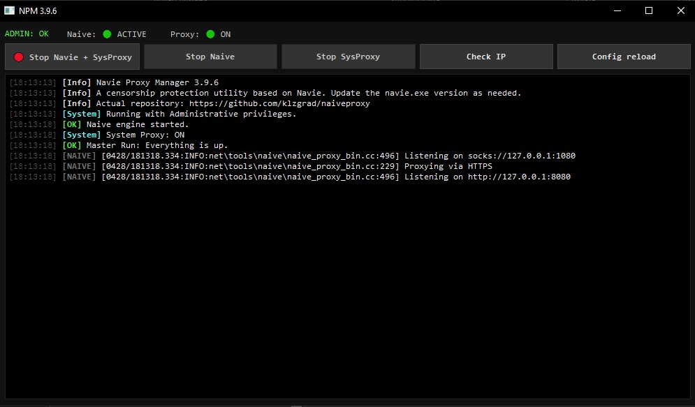

# NaiveProxy Manager (NPM)

Перед запуском проверте последнюю версию Naive Proxy (naive.exe)

Легкий и удобный графический интерфейс (GUI) на Python для управления **NaiveProxy** (https://github.com/klzgrad/naiveproxy) в Windows. 
Позволяет запускать ядро прокси, управлять системными настройками прокси-сервера и следить за логами в реальном времени.
При необходимости обновляйте naive.exe из оригинального репозитория.

[]

## Особенности
* **Двойной режим:** Запуск только ядра Naive или ядра вместе с системным прокси Windows.
* **Умные кнопки:** Интерфейс динамически меняется в зависимости от состояния служб.
* **Авто-админ:** Приложение само запрашивает права администратора, необходимые для изменения реестра Windows.
* **Консоль в реальном времени:** Просмотр вывода `naive.exe` прямо в окне приложения.
* **Оптимизация:** Автоматическая очистка лога (хранит последние 1000 строк).

## Структура файлов
Для работы приложения папка проекта должна выглядеть так:
```text
📦 project-folder
 ┣ NaiveProxyManager.exe
 ┣ naive.exe (ядро NaiveProxy отсюда: https://github.com/klzgrad/naiveproxy)
 ┗ config.json (ваш конфиг для NaiveProxy)
```
 ## Структура файлов для сборки
```text
 ┗ naive_manager_console_ver.py (консольная версия исходник)
 ┗ naive_manager.py (GUI версия Windows)
 ┗ app_icon.ico
```


## Зависимости
```
pip install PyQt6
# для GUI-версии
```
## Компиляция
```
pyinstaller --onefile --noconsole --name "NaiveProxyManager" --icon="app_icon.ico" naive_manager.py --clean
```

## Использование
Start Naive + SysProxy: Запускает naive.exe и прописывает 127.0.0.1:8080 в настройки интернета Windows.
Start Naive engine only: Только запуск процесса без изменения настроек системы.
Check IP: Проверка текущего внешнего IP через запущенный прокси (использует curl).
Config reload: Перечитывает файл config.json без перезагрузки всего приложения.

## Конфиг JSON
Используйте оригинальный конфиг Naive.
UDP включайте на сервере
```
{
  "listen": ["socks://127.0.0.1:1080", "http://127.0.0.1:8080"],
  "proxy": "https:/[LOGIN]:[PASSWORD]]@[DOMAIN]:[PORT]]?udp=1#[NAME]",
  "log": ""
}
```

## Важно
При закрытии приложения менеджер автоматически выключает системный прокси и завершает процесс naive.exe, чтобы не оставлять систему без интернета.

Для настройки Naive на сервере смотрите https://github.com/klzgrad/naiveproxy

Что бы работала телега установите в настройках "Использовать системный прокси"